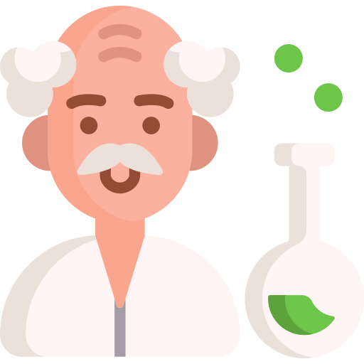
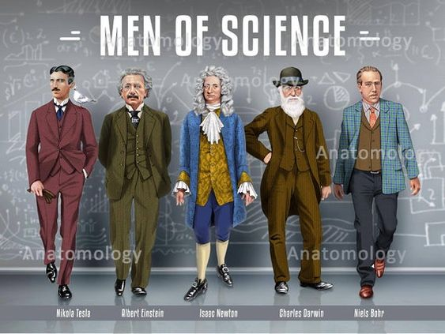

# Ajuda-Estudantil
```
<!DOCTYPE html>
<html lang="pt-br">
<head>
    <meta charset="UTF-8">
    <meta http-equiv="X-UA-Compatible" content="IE=edge">
    <meta name="viewport" content="width=device-width, initial-scale=1.0">
    <title>Ajuda Estudantil | Home</title>
    <link rel="stylesheet" href="css/style.css">
    <link rel="stylesheet" href="css/reset.css">
</head>
<body>
    <header>

        <a href="index.html"></a>

    <nav>
            <ul>

               <li><a href="index.html">Home</a></li>
               <li><a href="pesquisa.html">Procurar</a></li>

            </ul> 

        </nav>

    <div class="modoescuro">
            <label for="switch">
                    <input type="checkbox" id="switch"> Modo Escuro </input>
            </label>

        </div>         
       

    </header>

  <main>

    <section>
        
        <h1 id="sobre"></h1>

    </section>

    <section>
        <div class="curiosidades"> 
            <p>Exitem pessoas que dedicaram todo o tempo de sua vida, para criar algo que mudaria o mundo para sempre! conheça alguns deles <a href="pesquisa.html">aqui</a></p>
            
            
            <a href="pesquisa.html"></a>
        </div>
        
    </section>
  </main>

  <footer>

    <p>Instagram:<a href="https://www.instagram.com/n.a.e.2/"> @n.a.e.2</a></p>

  </footer>

  <script src="scripts/script.js"></script>
  
</body>

</html>

```
